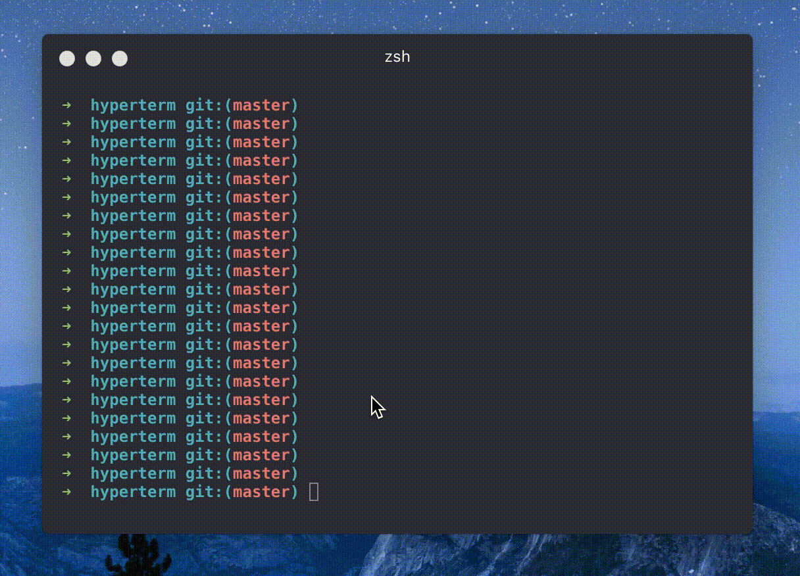

# hyperterm-alternatescroll for [hyperterm](https://hyperterm.org/)

[](https://www.npmjs.com/package/hyperterm-alternatescroll)

Missing feature for Hyper! This plugin allows you to use your scrollwheel/trackpad within apps like less, git log, nano, etc... 

## Requirement

Hyper **0.8.0** or the latest master branch.

# Demo

#### Without hyperterm-alternatescroll



#### With hyperterm-alternatescroll


# Installation

add `hyperterm-alternatescroll` to `~/.hyper.js`'s plugin list.

```javascript
{
	//...
	plugins:["hyperterm-alternatescroll"],
}
```

# Config

You can tweak the scroll speed in `~/.hyper.js`.
```javascript
module.exports = {
  config: {
    // for hyperterm-alternatescroll plugin
    alternateScroll: {
      // 1 to 100 is supported
      scrollSpeed: 80
    }
  }
}
```

# License

The MIT License (MIT)

Copyright (c) 2016 lkzhao
